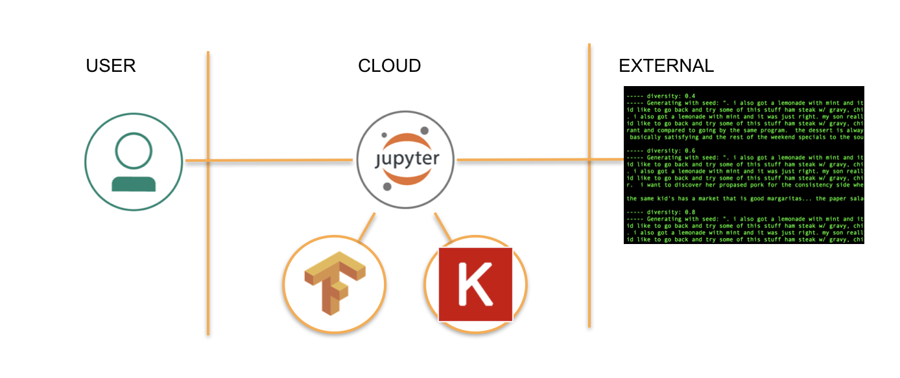
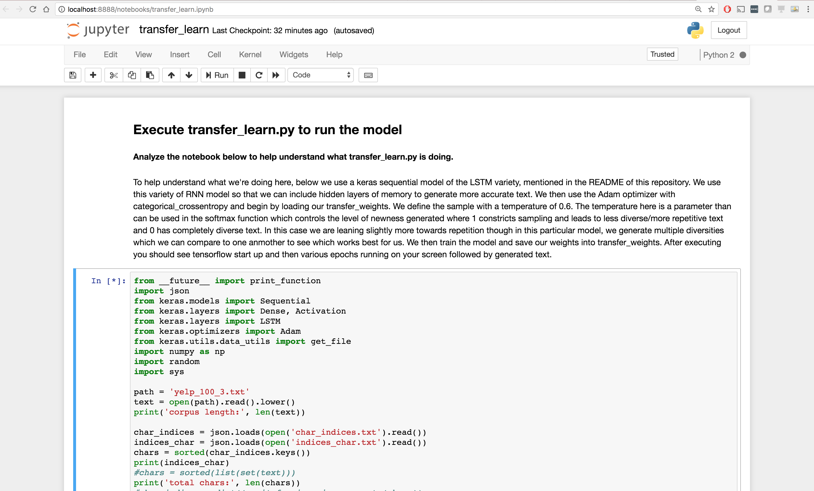
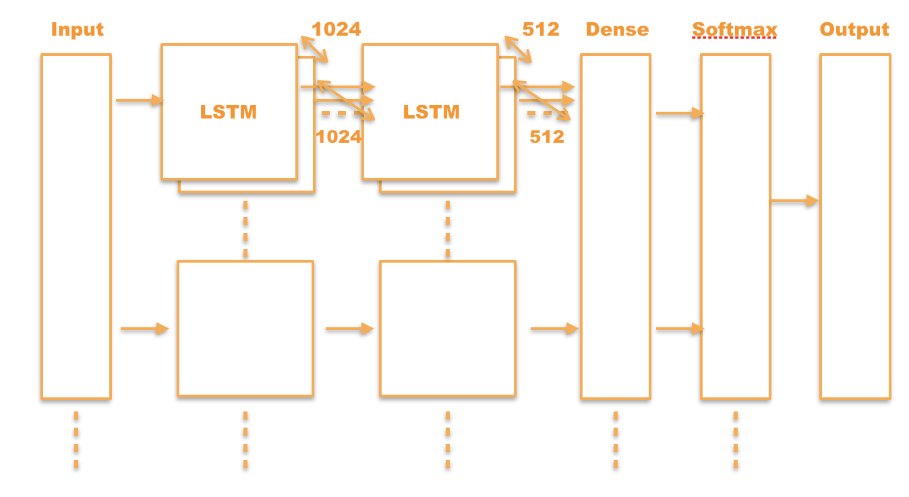
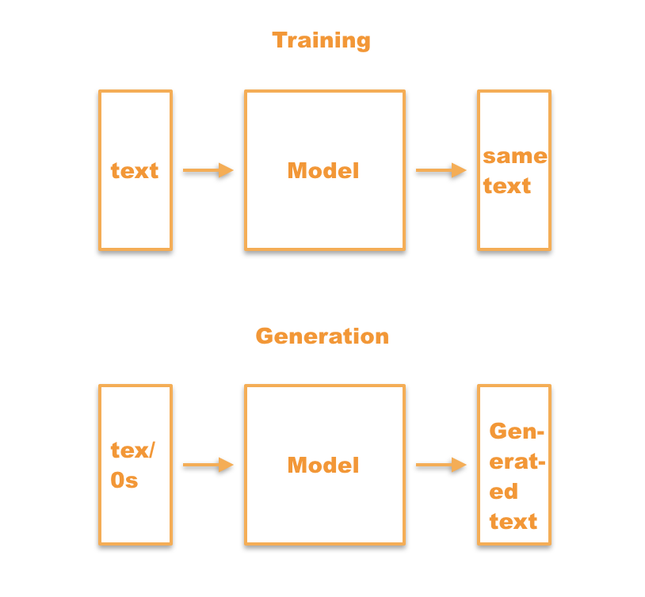
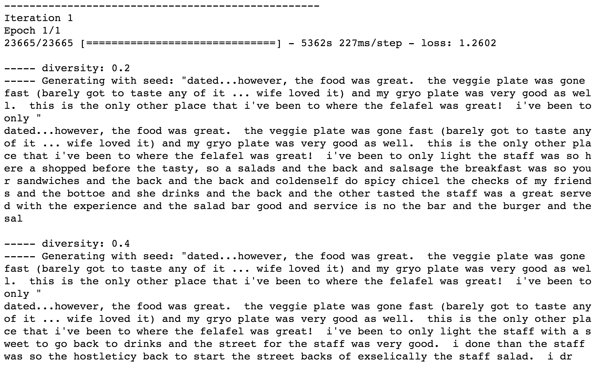

*Lea esto en otros idiomas: [English](README.md) - [中国](README-cn.md).*

## Entrenando un Modelo de Lenguaje Usando Keras y Tensorflow

Este Patrón de Código lo guiará a través de la instalación de Keras y Tensorflow, descargando datos de reviews de Yelp y entrenando un modelo de lenguaje usando Redes Neuronales Recurrentes (en inglés Recurrent Neural Networks RNN), para generar textos.

> Este patrón de código fue inspirado de una [entrada en el blog Hacknoon](https://hackernoon.com/how-to-generate-realistic-yelp-restaurant-reviews-with-keras-c1167c05e86d) y convertido en un notebook. El enfoque para generar texto es similar al [demo de generación de texto de Keras](https://github.com/keras-team/keras/blob/master/examples/lstm_text_generation.py) con algunos cambios para adaptarse a este escenario.

Usar el deep learning para generar información es un área de investigación y experimentación. En particular, el enfoque del modelo de deep learning de RNN tiene una cantidad aparentemente ilimitada de áreas a las que se puede aplicar, ya sea para soluciones a problemas actuales o aplicaciones en tecnologías futuras. Una de estas áreas de aplicación es la generación de texto, que es lo que introduce este patrón de código. La generación de texto se utiliza en la traducción de idiomas, la traducción automática y la corrección ortográfica. Todos estos son creados a través de algo llamado modelo de lenguaje. Este patrón de código ejecuta exactamente eso: un modelo de idioma que utiliza una RNN de memoria a largo corto plazo (en inglés Long Short Term Memory LSTM). Para algunos contextos, las RNN utilizan redes con capas ocultas de memoria para predecir el siguiente paso con la mayor probabilidad. A diferencia de las redes neuronales convolucionales (en inglés Convolutional Neural Networks CNN) que usan propagación hacia adelante, o más bien, avanzan a través de su tubería, las RNN utilizan la propagación hacia atrás, o vuelven en círculos a través de la tubería para hacer uso de la "memoria" mencionada anteriormente. Al hacer esto, las RNN pueden usar el texto ingresado para aprender cómo generar las siguientes letras o caracteres como su salida. La salida luego pasa a formar una palabra, que eventualmente termina como una colección de palabras, oraciones y párrafos. La parte LSTM del modelo le permite construir un modelo RNN aún más grande con un aprendizaje mejorado de las dependencias a largo plazo, o una mejor memoria. ¡Esto significa un rendimiento mejorado para esas palabras y oraciones que estamos generando!

Este modelo es relevante ya que la generación de texto tiene cada vez más demanda para resolver problemas de traducción, deletreo y reviews en varias industrias. En particular, la lucha contra las reviews falsas juega un papel importante en esta área de investigación. Las reviews falsas son un problema muy real para compañías como Amazon y Yelp, quienes confían en las reviews genuinas de los usuarios para respaldar sus productos y negocios que son destacados en sus sitios. Al momento de escribir esto, es muy fácil para las empresas pagar por reviews positivas falsas, las que terminan finalmente elevando sus ventas e ingresos. Es igualmente fácil generar reviews negativos para empresas competidoras. Desafortunadamente, esto lleva a los usuarios a lugares y productos de manera fraudulenta y puede potencialmente llevar a que alguien tenga una experiencia negativa o algo peor. Para combatir estos abusos y actividades ilegales, la generación de texto se puede usar para detectar el aspecto de una review cuando es auto-generada en comparación con una review genuina escrita por un usuario auténtico. Este patrón de código lo guía por los pasos para crear esta generación de texto a un alto nivel. Vamos a ver cómo abordar el problema con una pequeña parte de los datos de reviews de Yelp, pero luego usted puede aplicarlos a un conjunto mucho más grande y probar qué salida obtiene!

Los datos de Yelp originales utilizados en este patrón de código se pueden encontrar en [Kaggle](https://www.kaggle.com/c/yelp-recruiting/data) como un [archivo zip](yelp_test_set.zip) en este repositorio.

### ¿Pero qué son Keras y Tensorflow?

Si ha hecho clic en este patrón de código, imagino que usted ya tiene un nivel entre intermedio y principiante de deep learning y que está interesado en aprender más. Dondequiera que esté en ese espectro, usted probablemente piense que el machine learning y el deep learning son asombrosos (con lo que estoy de acuerdo) y que probablemente ha sido expuesto a algunos ejemplos y terminologías. Usted probablemente también entiende algo de Python y el hecho de que el deep learning es un subconjunto del machine learning (que a su vez es un subconjunto de la inteligencia artificial). Con esas suposiciones en mente, puedo explicar que Tensorflow es una librería de software de código abierto para machine learning, que le permite tener un seguimiento de todos sus modelos y también verlos con visualizaciones geniales.

Keras es una librería de deep learning que puede utilizar junto con Tensorflow y varias otras librerías de deep learning. Keras es muy fácil de usar, ya que le permite completar un modelo (por ejemplo, utilizando RNN) con muy pocas líneas de código, lo que hace que la vida de todos los científicos de datos (incluyéndome a mí mismo) sea mucho más fácil! Este proyecto resalta exactamente esa característica con su relativamente pequeña cantidad de código. Keras también le permite cambiar entre librerías en función de lo que intenta hacer, ahorrándole muchos dolores de cabeza y tiempo. Vamos a empezar, ¿vale?



## Flujo

1. Después de instalar los requisitos, Keras y Tensorflow, el usuario ejecuta el notebook.
2. Los datos de entrenamiento se utilizan para entrenar un modelo de lenguaje.
3. El nuevo texto es generado según el modelo y se devuelve al usuario.

## Componentes Incluidos

* [Keras](https://keras.io/): La librería de Deep Learning de Python.
* [Tensorflow](https://www.tensorflow.org/): Una librería de código abierto para Machine Intelligence.

## Tecnologías destacadas

* [Cloud](https://developer.ibm.com/depmodels/cloud/): Acceso a recursos informáticos y de tecnología de la información a través de internet.
* [Ciencia de Datos](https://medium.com/ibm-data-science-experience/): Sistemas y métodos científicos para analizar datos estructurados y no estructurados para extraer conocimientos y perspectivas.
* [Python](https://www.python.org/): Python es un lenguaje de programación que le permite trabajar más rápidamente e integrar sus sistemas de manera más efectiva.

# Prerrequisitos

1. Asegúrese de tener [Python](https://www.python.org/) 3.0 o superior, instalado.

2. Asegúrese de que las siguientes librerías del sistema están instaladas:

    * [pip](https://pip.pypa.io/en/stable/installing/) (para instalar librerías de Python)
    * [gcc](https://gcc.gnu.org/) (para compilar SciPy)

        * Para un mac, pip es instalado al momento de instalar Python. Ejemplo:

        ```
        brew install python
        brew install gcc
        ```

        * Para otros sistemas operativos, probar:

        ```
        sudo easy install pip
        sudo easy install gfortran
        ```

3. Asegúrese de que las siguientes librerías de Python están instaladas:

    * [NumPy](https://www.numpy.org/)
    * [SciPy](https://www.scipy.org/)
    * [pandas](https://pandas.pydata.org/)
    * [zipfile36](https://gitlab.com/takluyver/zipfile36)
    * [h5py](https://www.h5py.org/)

        ```
        pip install numpy
        pip install scipy
        pip install pandas
        pip install zipfile36
        pip install h5py
        ```

# Paso a paso

Este patrón se ejecuta a través de los siguientes pasos. Revisar el [notebook](transfer_learn.ipynb) para el código!

1. [Descargue e instale TensorFlow y Keras](#1-descargue-e-instale-tensorflow-y-keras)
2. [Clone el repositorio](#2-clone-el-repositorio)
3. [Entrene un modelo](#3-entrene-un-modelo)
4. [Analice los resultados](#4-analice-los-resultados)

## 1. Descargue e instale TensorFlow y Keras

* Instale TensorFlow.

    Consulte la [documentación de instalación de TensorFlow](https://www.tensorflow.org/install/) para obtener instrucciones sobre cómo instalar Tensorflow en todos los sistemas operativos compatibles. En la mayoría de los casos, un simple `pip install tensorflow` instalará la librería Python de TensorFlow.

* Instale Keras.

    Consulte la [documentación de instalación de Keras](https://keras.io/#getting-started-30-seconds-to-keras) para obtener instrucciones sobre cómo instalar Keras en todos los sistemas operativos compatibles. En la mayoría de los casos, un simple 'pip install keras` instalará la librería Python de Keras.


## 2. Clone el repositorio

* Clone este repositorio y acceda al nuevo directorio:

```
git clone https://github.com/IBM/deep-learning-language-model
cd deep-learning-language-model
```

Algunas cosas para mencionar sobre los contenidos del repositorio:

* [transfer_learn.ipynb](transfer_learn.ipynb): Este es el notebook que estaremos ejecutando.
* [yelp_test_set.zip](yelp_test_set.zip): Es un conjunto completo de datos que contiene comentarios de Yelp! de [Kaggle](https://www.kaggle.com/c/yelp-recruiting/data)
* [yelp_100_3.txt](yelp_100_3.txt): Un fragmento del conjunto de datos anterior.
* [pesos de transferencia](transfer_weights): Un modelo que usaremos como base para este ejercicio.
* [indices_char.txt](indices_char.txt) y [char_indices.txt](char_indices.txt): Estos dos archivos de texto definen cómo se corresponden entre sí las letras y la puntuación.

*Una nota rápida sobre los datos de prueba:* Estos datos nos permiten usar reviews auténticas de Yelp como entrada para nuestro modelo de lenguaje. Esto significa que nuestro modelo recorrerá las reviews y generará reviews similares de Yelp. Si se usara un conjunto de datos diferente, como una novela de Hemingway, generaríamos un texto similar al estilo de Hemingway. El modelo que construimos en el notebook considerará ciertas características y su relevancia para el idioma inglés y cómo esas características contribuyen a construir reviews. Una vez que el lector se sienta lo suficientemente familiarizado con el cuaderno, puede usar el conjunto de datos completo.

*Una nota rápida sobre el modelo de `transferencia de pesos`:* Los pesos son los que nos permiten ajustar el modelo y aumentar la precisión a medida que nuestro modelo aprende. Usted no tendrá que preocuparse por ajustar los pesos aquí, ya que el modelo lo hará automáticamente cuando se guarde en `transfer_weights` después de que se ejecute. Ahora vamos a entrenar el modelo.

## 3. Entrene un modelo

* Asegúrese de tener todos los archivos que descargó en la misma carpeta.
* Ejecute [`transfer_learn.ipynb`](transfer_learn.ipynb) ejecutando la celda con el código.
* Una vez que la haya ejecutado, debería ver el inicio de TensorFlow y luego varios epochs ejecutándose en su pantalla, seguidas de un texto generado con diversidad creciente.



> La imagen de arriba muestra a un usuario ejecutando el notebook localmente

Para ayudar a entender lo que está pasando aquí, en el archivo [transfer_learn.ipynb](transfer_learn.ipynb) usamos un modelo secuencial de Keras de la variedad LSTM, mencionado anteriormente. Usamos esta variedad para que podamos incluir capas ocultas de memoria para generar texto más preciso. Aquí el maxlen se establece automáticamente a ninguno. El maxlen se refiere a la longitud máxima de la secuencia y puede ser ninguna o un entero. Luego usamos el optimizador Adam con `categorical_crossentropy` y comenzamos cargando nuestros `transfer_weights`. Definimos la muestra con una temperatura de 0.6. La temperatura aquí es un parámetro que se puede usar en la función softmax que controla el nivel de novedad generado donde 1 restringe el muestreo y conduce a un texto menos diverso / más repetitivo y 0 tiene un texto completamente diverso. En este caso nos inclinamos un poco más hacia la repetición, sin embargo, en este modelo en particular, generamos múltiples versiones de esto con una escala variable de diversidades que podemos comparar entre sí y ver cuál funciona mejor para nosotros. También verá el uso de enumerar, que en última instancia nos permite crear un contador automático y un bucle sobre la información. Luego entrenamos el modelo y guardamos nuestros pesos en `transfer_weights`. Cada vez que entrene el modelo, guardará los pesos aprendidos para ayudar a mejorar la precisión de la generación de texto.



Como puede ver en el diagrama anterior, el texto ingresado se envía a través de varias capas del modelo LSTM (hacia adelante y hacia atrás) y luego se envía a través de una capa densa seguida de una capa de softmax. Esto considera la información e itera sobre los datos a nivel de carácter. Esto significa que considera el contexto como los caracteres anteriores para determinar los siguientes caracteres, últimamente formando palabras y luego oraciones para generar una review completa.



## 4. Analice los resultados

Como puede ver en la imagen a continuación, debe esperar que el texto se genere con diferentes diversidades y luego se guarde nuevamente en los pesos. Con esta salida puede ver qué salidas diferentes se basan en diferentes diversidades de texto (más diverso frente a menos/más repetitivo).



> La figura de arriba muestra el resultado de la ejecución del notebook, una review de Yelp! generada.

Felicidades! Ahora ha aprendido cómo generar texto en función de los datos que le ha proporcionado. Ahora puede desafiarse a si mismo probando todo el conjunto de datos de Yelp u otros conjuntos de datos de texto! Ya lo tiene!

# Enlaces

* [Watson Studio](https://www.ibm.com/cloud/watson-studio)
* [Jupyter Notebook](https://jupyter.org/): Una aplicación web de código abierto que le permite crear y compartir documentos que contienen código, ecuaciones, visualizaciones y texto explicativo.
* [Keras](https://keras.io/): La librería de Deep Learning de Python.
* [Tensorflow](https://www.tensorflow.org/): Una librería de software de código abierto para Machine Intelligence.

# Aprenda más

* **Patrón de código de Análisis de datos**: ¿Disfrutó con este patrón de código? Eche un vistazo a nuestro otro [Patrón de código de Análisis de datos](https://developer.ibm.com/technologies/data-science/)
* **Lista de reproducción de IA y Patrones de Código para datos**: Guarde un marcador de nuestra [lista de reproducción](https://www.youtube.com/playlist?list=PLzUbsvIyrNfknNewObx5N7uGZ5FKH0Fde) con todos nuestros videos de Patrones de Código
* **Watson Studio**: Domine el arte de la ciencia de datos con [Watson Studio](https://www.ibm.com/cloud/watson-studio) de IBM
* **Spark en IBM Cloud**: ¿Necesita un clúster Spark? Cree hasta 30 ejecutores de Spark en IBM Cloud con nuestro [servicio de Spark](https://cloud.ibm.com/catalog/services/apache-spark)

# Licencia

Este patrón de código se otorga bajo la Licencia de Software Apache, Versión 2. Los objetos de código de terceros que se invocan dentro de este patrón de código tienen licencia de sus respectivos proveedores conforme a sus propias licencias. Las contribuciones están sujetas al [Certificado de origen del desarrollador, Versión 1.1 (DCO)](https://developercertificate.org/) y la [Licencia de software de Apache, Versión 2](https://www.apache.org/licenses/LICENSE-2.0.txt).

[Preguntas frecuentes sobre la licencia de software de Apache (ASL)](https://www.apache.org/foundation/license-faq.html#WhatDoesItMEAN)
